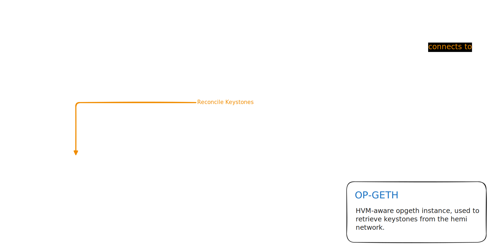

# Hemi PoP Miner (`popmd`)

`popmd` is the lightweight Hemi PoP (Proof-of-Proof) miner daemon.

<details>
  <summary>Table of Contents</summary>

<!-- TOC -->
* [Hemi PoP Miner (`popmd`)](#hemi-pop-miner-popmd)
  * [System Requirements](#system-requirements)
  * [Running `popmd`](#running-popmd)
    * [Standalone binary (Recommended)](#standalone-binary-recommended)
    * [Docker (Recommended)](#docker-recommended)
    * [Building Docker images](#building-docker-images)
      * [Prerequisites](#prerequisites)
      * [Execution](#execution)
    * [Building from Source](#building-from-source)
      * [Prerequisites](#prerequisites-1)
      * [Option 1: Using Makefile](#option-1-using-makefile)
      * [Option 2: Standalone Build](#option-2-standalone-build)
  * [Runtime Settings](#runtime-settings)
  * [FAQ](#faq)
    * [How much does it cost to run `popmd`?](#how-much-does-it-cost-to-run-popmd)
    * [How many HEMI tokens will I be awarded for mining?](#how-many-hemi-tokens-will-i-be-awarded-for-mining)
<!-- TOC -->
</details>



The PoP Miner periodically receives information about the current state of the Hemi Network, in the form of a
keystone. When a keystone is received, the PoP Miner creates a Bitcoin transaction containing the keystone data, and
broadcasts the transaction to Bitcoin - tying the Hemi Network's state to Bitcoin.

PoP Mining on Hemi is incentivised with a reward algorithm, which pays out tokens for helping secure the Hemi Network
by broadcasting network keystones.

## System Requirements

The Hemi PoP Miner daemon (`popmd`) is **extremely lightweight**. It will run on almost any system, and requires
minimal system resources.

By relying on connections to a Bitcoin node with indexed Hemi keystones (such as [`tbcd`](../tbcd/README.md)), and
a [hVM-aware op-geth node](https://github.com/hemilabs/op-geth), `popmd` requires very minimal CPU and RAM to operate,
as most heavy functionality is offloaded to these daemons.

> [!TIP]
> No additional hardware, such as a GPU, is required to run a PoP Miner.

## Running `popmd`

We support running `popmd` in Docker or as a standalone binary. We provide pre-built binaries, or you can build the
`popmd` binary from source code.

> [!IMPORTANT]
> Running a PoP Miner requires URLs for the following services:
>  - [BTC Gozer](../../bitcoin/wallet/README.md) with indexed keystones, such as [`tbcd`](../tbcd/README.md).
>  - [hVM-aware op-geth node](https://github.com/hemilabs/op-geth)

### Standalone binary (Recommended)

Pre-built binaries for Linux, macOS, Windows, and OpenBSD are available
via [GitHub Releases](https://github.com/hemilabs/heminetwork/releases).

After downloading and extracting the archive for your system, start `popmd` by running:

```shell
/path/to/popmd
```

> [!NOTE]
> In production environments, especially when running PoP Miners on mainnet, we highly recommend verifying the checksum
> of the downloaded archive, as well as signatures provided for the archive, to ensure the security of your PoP Miner.

### Docker (Recommended)

Docker images for `popmd` are published to
both the [GitHub Container Registry](https://github.com/orgs/hemilabs/packages/container/package/popmd)
and [Docker Hub](https://hub.docker.com/r/hemilabs/popmd).

**Example**

```shell
# Pull Hemi popmd image from Docker Hub
docker pull hemilabs/popmd

# Run the built image using the correct environment variables
docker run \
  -e POPM_BITCOIN_SECRET=<YOUR_BITCOIN_SECRET> \
  -e POPM_OPGETH_URL=<YOUR_OPGETH_URL> \
  -e POPM_BITCOIN_URL=<YOUR_BITCOIN_URL> \
  hemilabs/popmd:latest
```

> [!NOTE]
> In production environments, especially when running PoP Miners on mainnet, we highly recommend verifying image
> signatures and pinning images to SHA-256 digests, to ensure the security of your PoP Miner.

### Building Docker images

The `heminetwork` repository provides Docker files, which can be used to build Docker images locally.

#### Prerequisites

- `docker` CLI installed and setup.

#### Execution

To build the Docker image locally and run a `popmd` daemon, use the following:

> [!IMPORTANT]
> Check the [runtime settings](#runtime-settings) section for a full list of available environment variables.

```shell
cd heminetwork

# Build the image using the popmd Dockerfile
docker build -t popmd:dev -f ./docker/popmd/Dockerfile .

# Run the built image using the correct environment variables
docker run \
  -e POPM_BITCOIN_SECRET=<YOUR_BITCOIN_SECRET> \
  -e POPM_OPGETH_URL=<YOUR_OPGETH_URL> \
  -e POPM_BITCOIN_URL=<YOUR_BITCOIN_URL> \
  popmd:dev
```

### Building from Source

#### Prerequisites

- [Go v1.24+](https://go.dev/dl/)
- `make` (optional)

#### Option 1: Using Makefile

If you have `make` installed on your system, you may build the binary by running the following code snippet:

```shell
cd heminetwork

# Download and install dependencies
make deps

# Output binary will be written to bin/popmd or bin/popmd.exe
make popmd
```

#### Option 2: Standalone Build

If you prefer not to use the Makefile:

```shell
cd heminetwork

# Build the binary (output will be popmd or popmd.exe)
go build ./cmd/popmd/

# Install the binary (output will be in your GOBIN directory)
go install ./cmd/popmd/
```

<br>

Once the `popmd` binary is built using one of the two options above, you can start it by running:

```shell
/path/to/popmd
```

## Runtime Settings

`popmd` is **designed to be run both locally and in cloud environments**, as such it uses environment variables for
runtime settings.

To see a full list of runtime settings, execute `popmd` with the **`--help`** flag:

```shell
./bin/popmd --h
# Hemi Proof-of-Proof Miner v2.0.0-dev+76217560a (popmd, go1.24.5 linux/amd64)
# Usage:
#         help (this help)
# Environment:
#         POPM_BITCOIN_NETWORK   : bitcoin chain to connect to (ex. "mainnet", "testnet3|testnet4") (default: mainnet)
#         POPM_BITCOIN_SECRET    : bitcoin secret (mnemonic, seed, xpriv) (required) 
#         POPM_BITCOIN_URL       : tbc bitcoin url to connect to (default: ws://localhost:8082/v1/ws)
#         POPM_LOG_LEVEL         : loglevel for various packages; INFO, DEBUG and TRACE (default: popmd=INFO;popm=INFO)
#         POPM_OPGETH_URL        : URL for opgeth (default: localhost:9999)
#         POPM_PPROF_ADDRESS     : address and port popm pprof listens on (open <address>/debug/pprof to see available profiles) 
#         POPM_PROMETHEUS_ADDRESS: address and port popm prometheus listens on 
#         POPM_REMINE_THRESHOLD  : the number of L2 Keystones behind the latest seen that we are willing to remine, this is handy for re-orgs (default: 0)
#         POPM_STATIC_FEE        : static fee amount in sats/byte; overrides fee estimation if greater than 0. Can be decimal (ex. 1.5 sats/byte) (default: 0)
```

Namely, ensure the following variables are properly set:

> [!CAUTION]
> Running a PoP Miner requires providing a private key for a funded Bitcoin wallet. It is important to keep this
> private key safe and secure, to prevent loss of funds.
> 
> It is recommended to create a new wallet specifically for use by the PoP Miner, and not to reuse existing wallets.

- `POPM_BITCOIN_NETWORK`: This determines what Bitcoin network `popmd` should connect to. This defaults to `mainnet`,
  however `testnet3`, `testnet4` and `localnet` are also available for test environments.

- `POPM_BITCOIN_SECRET`: A funded Bitcoin address is necessary in order to sign, broadcast, and get rewarded for the
  transactions constructed by `popmd`. The private key for the funded wallet must be provided here.

- `POPM_BITCOIN_URL`*: URL to the Bitcoin node used in order to transmit data to and from the Bitcoin
  network. [Read more on how to run your own `tbcd` instance here](../tbcd/README.md).

- `POPM_OPGETH_URL`: URL to an accessible hVM-aware op-geth instance, used to retrieve keystones from the Hemi Network.

> [!NOTE]
> \* `TBC` is currently the only functional Bitcoin node providing indexed Hemi keystones.

## FAQ

### How much does it cost to run `popmd`?

Hemi L2 Blocks are generated approximately every 12 seconds, and a keystone is generated every 25 blocks. As such:

- `12 * 25` = `300` seconds (5 minutes) between keystones
- `86400 / 300` = `288` keystones per day

Considering that each transaction created by the PoP Miner has a size of `284 vB` and presuming an average bitcoin
transaction fee of `3 sats/vB`:

- `284 * 3` = `852 sats` per PoP transaction
- `852 * 288` = `245376 sats` or `0.00245376 BTC` per day

The value of BTC can fluctuate heavily, but presuming a cost of `110,000 USD / BTC`, it would cost `~270 USD` per day
to run `popmd` on mainnet - assuming the PoP Miner broadcasts a transaction for every generated Hemi keystone.

> [!WARNING]
> These are example values ONLY. The presented values are not guaranteed, and may not be up-to-date.
> Different versions of the network's protocols and daemons may incur higher costs and fees. You should get up-to-date
> values yourself to determine if PoP mining makes sense for you.

### How many HEMI tokens will I be awarded for mining?

*Last updated: August 2025*

With the current PoP payout algorithm, each keystone has a total payout of `100 HEMI`, which is divided by the number
of PoP transactions that mine said keystone.

On average, a new keystone is created every 5 minutes, meaning `28,800 HEMI` is paid out to PoP miners per day.

The total payout is divided between the PoP Miners which broadcast a transaction for a keystone, meaning that the total
payout a single PoP Miner will receive is heavily dependent on the number of PoP Miners actively broadcasting.

> [!WARNING]
> These values are not guaranteed, and may not be up-to-date. Different versions of the network's protocols and daemons
> may incur higher costs or fees. You should get up-to-date values yourself to determine if PoP mining makes sense for
> you.
