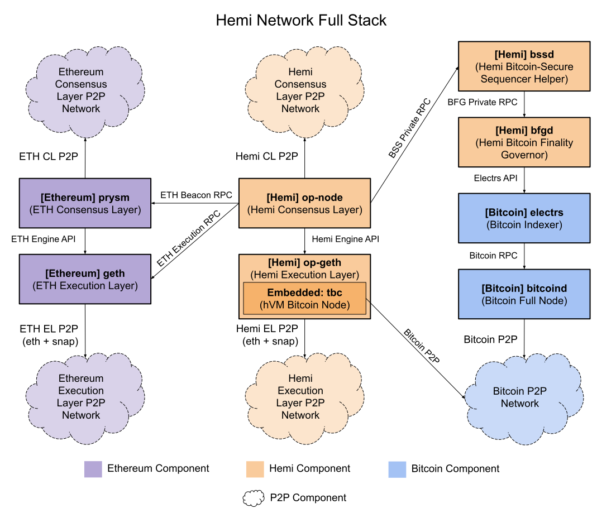
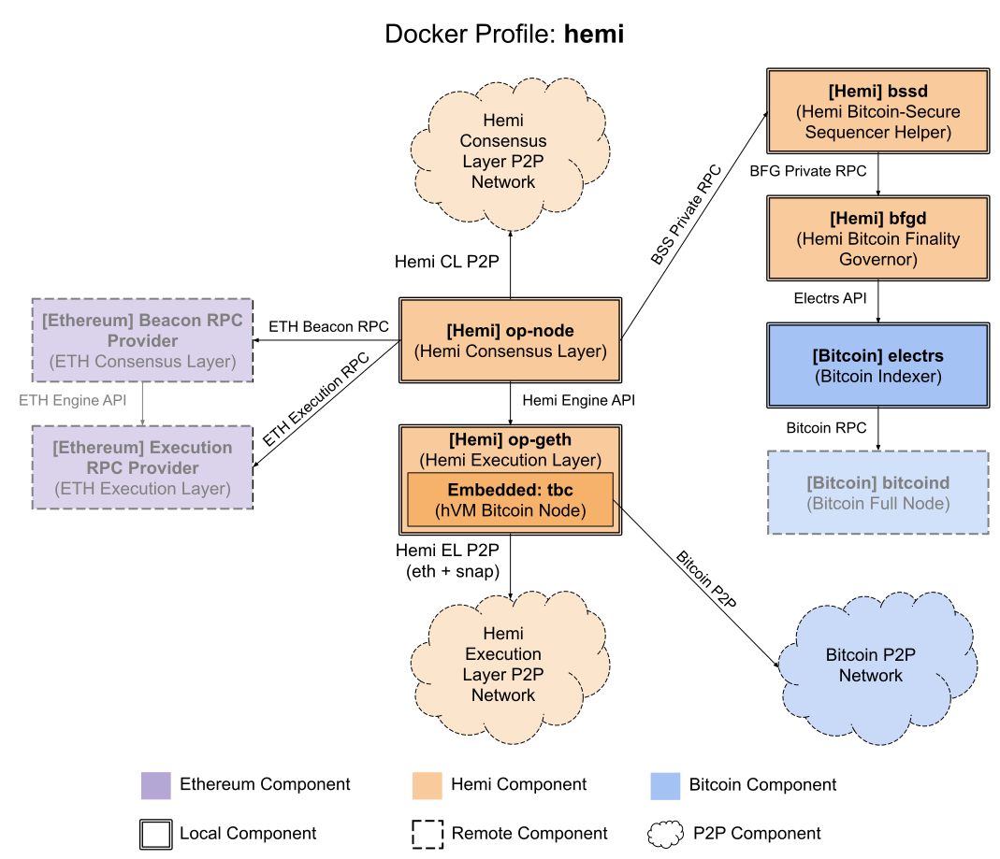
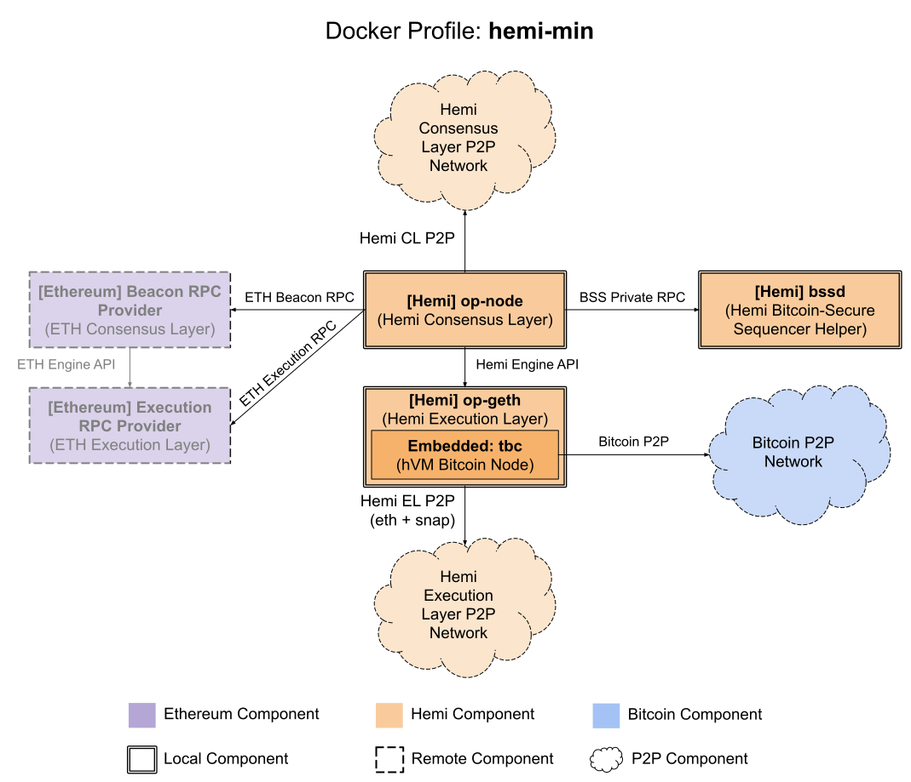
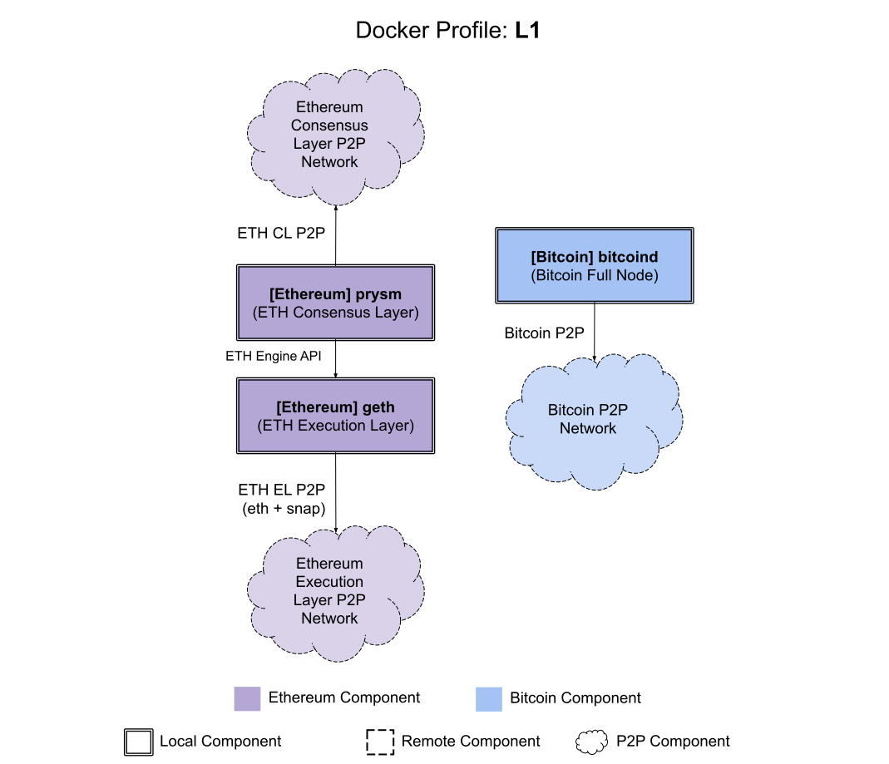

# Running the Hemi stack

This document details how to run the full Hemi stack with P2P nodes and RPC access. *This does NOT run a batcher or
sequencer.*

> [!NOTE]
> This setup is only for users looking to run a full node on the Hemi network, and is not required to use a wallet (
> Metamask, Rabby, etc.) to interact with dApps on Hemi or run a PoP Miner.


<details>
  <summary>Table of Contents</summary>

<!-- TOC -->
* [Running the Hemi stack](#running-the-hemi-stack)
  * [Quickstart Summary](#quickstart-summary)
  * [Prerequisites](#prerequisites)
    * [System Requirements](#system-requirements)
      * [CPU, RAM, and Disk](#cpu-ram-and-disk)
      * [ulimits](#ulimits)
  * [Setup and Installation](#setup-and-installation)
    * [Checking Prerequisites](#checking-prerequisites)
    * [Cloning the heminetwork Repository](#cloning-the-heminetwork-repository)
    * [Hemi Components](#hemi-components)
    * [Docker Profiles](#docker-profiles)
      * [Docker Profile: full](#docker-profile-full)
      * [Docker Profile: hemi](#docker-profile-hemi)
      * [Docker Profile: hemi-min](#docker-profile-hemi-min)
      * [Docker Profile: L1](#docker-profile-l1)
    * [⚠️ Important Note on Security](#-important-note-on-security)
  * [Running with Docker Compose](#running-with-docker-compose)
    * [Node Synchronization Type](#node-synchronization-type)
    * [Generating Files](#generating-files)
    * [Run with Docker Compose](#run-with-docker-compose)
      * [For Testnet](#for-testnet)
      * [For Mainnet](#for-mainnet)
  * [Accessing the Nodes](#accessing-the-nodes)
  * [Peer-to-Peer (P2P)](#peer-to-peer-p2p)
    * [Behavior of Incorrectly Peered Components](#behavior-of-incorrectly-peered-components)
  * [Bring Your Own L1s](#bring-your-own-l1s)
  * [Monitoring](#monitoring)
  * [Running Without Docker](#running-without-docker)
<!-- TOC -->
</details>

---

## Quickstart Summary

1. Decide on which Hemi components you want to run based off of the [Docker profiles](#docker-profiles).
2. Ensure you have the required [prerequisites](#prerequisites) installed and your system matches the system
   requirements for your chosen Docker profile.
3. [Clone the Hemi Network repository](#cloning-the-heminetwork-repository).
4. Determine which [Node Synchronization Type](#node-synchronization-type) suits your needs.
5. [Generate](#generating-files) the config/startup files based on your network (`mainnet` or `testnet`) and your chosen
   synchronization type
6. If you are running the `hemi` or `hemi-min` profile, [configure](#bring-your-own-l1s) your `.env` file with the L1
   RPC endpoints to use
8. [Run the compose files](#run-with-docker-compose) with your chosen Docker profile to start up all the relevant daemons.
9. Wait for everything to sync, which can take several days depending on your Docker Profile and synchronization type.
10. [Connect to your nodes](#accessing-the-nodes) using the RPC endpoints.
11. [Use the monitoring script](#monitoring) for additional visibility into the status of your nodes.

## Prerequisites

This guide assumes you are running [Docker](https://docs.docker.com/get-started/get-docker/)
and [Docker Compose](https://docs.docker.com/compose/) on Ubuntu 24.04 (the latest LTS). Running on other setups is
possible, but may not be fully supported.

Docker images for each Hemi Network component is published to [Docker Hub](https://hub.docker.com/u/hemilabs).

### System Requirements

#### CPU, RAM, and Disk

You can choose to run several different configurations (implemented as [Docker Profiles](#docker-profiles)), each with
their own requirements:

| Profile  | CPU Cores | Memory | Disk (NVMe Recommended) |
|----------|-----------|--------|-------------------------|
| full     | 8         | 40GB   | 6TB                     |
| hemi     | 2         | 16GB   | 3TB                     |
| hemi-min | 2         | 12GB   | 2TB                     |
| L1       | 6         | 24GB   | 3TB                     |

> [!WARNING]
> Over time, these disk space requirements will grow. The above values represent the current requirements (as of
> Q1 2025) with a buffer that should be sufficient for at least an additional year. It is highly recommended to monitor
> disk usage to prevent the node from running out of disk space.

#### ulimits

Certain components of the network require a very large number of open files. The startup will attempt to set
the `ulimits` properly, however it will exit quickly with an error if your system does not allow high enough ulimits.

## Setup and Installation

### Checking Prerequisites

Check that your system matches the [prerequisites](#prerequisites) for the profile you want to run. Make sure that the
following are installed and setup:

- [Docker](https://docs.docker.com/get-started/get-docker/)
- [Docker Compose](https://docs.docker.com/compose/)

### Cloning the heminetwork Repository

To get started, clone the `hemilabs/heminetwork` repository:

```sh
# Clone with HTTP
git clone https://github.com/hemilabs/heminetwork.git
cd heminetwork
```

Or to use SSH:

```sh
# Clone with SSH
git clone ssh://git@github.com/hemilabs/heminetwork.git
cd heminetwork
```

### Hemi Components

> [!TIP]
> You do not have to run all network daemons, depending on your use-case. See the [Docker Profiles](#docker-profiles)
> section to determine which configuration is appropriate for your use-case(s) and trust tolerance.

The following daemons comprise the Hemi stack. They are all run under Docker Compose:

1. bitcoind
2. electrs
3. geth
4. prysm
5. op-geth
6. op-node
7. bssd
8. bfgd
9. postgres (used by bfgd)



### Docker Profiles

There are four different docker profiles you can choose from, depending on your use case and trust tolerance.

> [!TIP]
> The Docker profile setting is independent of the [Node Synchronization Type](#node-synchronization-type), which
> determines how the `op-geth` instance performs its one-time **initial** sync regardless of the stack setup. Any of
> the profiles that include an op-geth instance can be configured to use either of the initial synchronization types.

The following table provides details on which components are run locally as part of each profile:

| Profile  | [HEMI]<br> op-geth | [HEMI]<br> op-node | [HEMI]<br> bssd    | [HEMI]<br> bfgd    | [ETH]<br> prysm    | [ETH]<br> geth     | [BTC]<br> electrs  | [BTC]<br> bitcoind |
|----------|--------------------|--------------------|--------------------|--------------------|--------------------|--------------------|--------------------|--------------------|
| full     | :white_check_mark: | :white_check_mark: | :white_check_mark: | :white_check_mark: | :white_check_mark: | :white_check_mark: | :white_check_mark: | :white_check_mark: |
| hemi     | :white_check_mark: | :white_check_mark: | :white_check_mark: | :white_check_mark: | :x:                | :x:                | :white_check_mark: | :x:                |
| hemi-min | :white_check_mark: | :white_check_mark: | :white_check_mark: | :x:                | :x:                | :x:                | :x:                | :x:                |
| L1       | :x:                | :x:                | :x:                | :x:                | :white_check_mark: | :white_check_mark: | :x:                | :white_check_mark: |

> [!TIP]
> The "L1" profile does not run any Hemi-specific infrastructure; it is provided to allow users to run the L1 components
> separately from the Hemi components.

Different node configurations support different Hemi use cases:

| Profile  | Standard RPC<br>(Wallets, most dApps, etc.) | Consensus RPC<br>(State Roots, Sync Status, etc.) | Extended Consensus RPC<br>(BTC Finality) | Fully Local PoP Mining | Trustless ETH Derivation                               | Trustless BTC Indexing                                 |
|----------|---------------------------------------------|---------------------------------------------------|------------------------------------------|------------------------|--------------------------------------------------------|--------------------------------------------------------|
| full     | :white_check_mark:                          | :white_check_mark:                                | :white_check_mark:                       | :white_check_mark:     | :white_check_mark:                                     | :white_check_mark:                                     |
| hemi     | :white_check_mark:                          | :white_check_mark:                                | :white_check_mark:                       | :white_check_mark:     | :x:                                                    | :x:                                                    |
| hemi-min | :white_check_mark:                          | :white_check_mark:                                | :x:                                      | :x:                    | :x:                                                    | :x:                                                    |
| L1       | :x:                                         | :x:                                               | :x:                                      | :x:                    | :white_check_mark:<br>(for paired hemi/hemi-min stack) | :white_check_mark:<br>(for paired hemi/hemi-min stack) |

> [!TIP]
> The `full` profile supports all features, operates entirely trustlessly, and does not pair with another profile.
>
> The `hemi` and `hemi-min` profiles can be run either with external trusted RPC endpoints for L1 (BTC+ETH) data, or can
> be paired with an `L1` profile.
> 
> Running the `hemi` profile paired with an `L1` profile provides the same features and
> trust model as a `full` profile. Running the `hemi-min` profile paired with an `L1` profile provides the same _trust
model_ as a `full` profile, but does not provide the Extended Consensus RPC (BTC Finality data available from `op-node`
> or `BFG`) or support fully local PoP mining (connecting a PoP miner to a self-hosted BFG instance).

> [!NOTE]
> All node configurations which include `op-geth` and provide Standard RPC functionality include a Bitcoin full node as
> part of the `TBC` instance embedded inside `op-geth`, which is required to correctly process hVM state transitions
> that involve smart contract calls to hVM precompiles that fetch indexed Bitcoin data. This is essential to ensure the
> trustless computation of hVM state transitions calculated by `op-geth` nodes (post-snap-sync, if used) regardless of
> the supporting network stack.
> 
> The `TBC` full BTC node within `op-geth` is separate from the _optional_ `bitcoind` BTC full node that is used by
> electrs in the `full` or `hemi` profiles, which provides an external independent view of Bitcoin for calculating
> Bitcoin finality information for external consumers requesting this information over the `op-node` and/or `BFG` RPC
> endpoints, and facilitates PoP miner interactions with the Bitcoin network. Both of the `TBC` and `bitcoind` BTC nodes
> peer directly with the Bitcoin network and operate entirely independently.
>
> Advanced users with a synced `bitcoind` instance can configure the startup configuration of `op-geth` to pass-through
> instructions to direct the embedded `TBC` node to directly peer with the `bitcoind` node, which can help speed up the
> initial Bitcoin P2P sync that `TBC` performs (especially on slow connections) if desired.

#### Docker Profile: full

This profile includes everything: full Bitcoin and Ethereum (L1) nodes, as well as a full Hemi node.

It supports all ways of interacting with the Hemi network (Standard RPC + Extended Consensus RPC, Fully Local PoP
Mining).

With this mode, your Hemi node is synchronized entirely from ETH DA data trustlessly synchronized from the Ethereum
network, Bitcoin finality information is calculated based on BTC data trustlessly synchronized from the Bitcoin network,
and PoP miners connecting to the BFG endpoint are interfacing with the Bitcoin network (fetching UTXOs and sending
transactions) completely trustlessly.


#### Docker Profile: hemi

This profile runs all components of the Hemi stack, but relies on external Bitcoin and Ethereum RPC endpoints.

It supports all ways of interacting with the Hemi network (Standard RPC + Extended Consensus RPC, Fully Local PoP
Mining).

However, your Hemi node is synchronized from ETH DA data provided by external Ethereum (Execution + Beacon) RPC nodes,
Bitcoin finality information is calculated based on BTC data provided by an external Bitcoin RPC node, and PoP miners
connecting to the BFG endpoint are also interfacing with the Bitcoin network (fetching UTXOs and sending transactions)
through this external Bitcoin RPC node.



#### Docker Profile: hemi-min

This profile only runs the minimum components of the Hemi stack required to interact with dApps on the Hemi network, and
relies on external Bitcoin and Ethereum RPC endpoints.

It supports the primary ways of interacting with the Hemi network (Standard RPC + Consensus RPC), but does not support
the Extended Consensus RPC (Bitcoin Finality statistics from BFG/op-node) or Fully Local PoP Mining.

Similarly to the `hemi` profile, a node running the `hemi-min` profile is synchronized from ETH DA data provided by
external Ethereum (Execution + Beacon) RPC nodes. However, no Bitcoin finality information is available to external
services, and there is no local BFG node to run a Fully Local PoP Miner.



#### Docker Profile: L1

> [!NOTE]
> This profile does not run any Hemi stack components, and is only meant to run the L1 ETH+BTC components separately in
> support of either a `hemi` or `hemi-min` profile run separately.

This profile only runs the Bitcoin and Ethereum L1 components required to support the Hemi stack. It does not directly
support any interaction with the Hemi network, but allows a separate Hemi network stack to run trustlessly.

If you want to run multiple Hemi nodes trustlessly, running the L1 components separately helps with scalability by not
requiring a 1:1 ratio of Hemi to supporting L1 daemon nodes.



### ⚠️ Important Note on Security

> [!CAUTION]
> **Many of the required credentials are hard-coded, as the assumption is you are not exposing the services' ports to
> the outside world.** This allows communication between the services locally.
>
> :warning: **In setups where you plan to expose the ports, ensure that you change any credential values
> (e.g. JWT token, cookie, passwords).**

## Running with Docker Compose

### Node Synchronization Type

Nodes can perform initial synchronization in two modes, `archive` or `snap`.  `archive` rederives the entire Hemi chain
from L1 data and stores historical information while `snap` synchronizes Hemi state trie and hVM BTC state data based on
the network state at the time the `snap` sync is performed. After performing an initial `snap` sync, a node will switch
to performing full L1 derivation and storing historical information after the point in the chain where the `snap` sync
occurred.

> [!IMPORTANT]
> Most users (including dApp developers wishing to run infrastructure to support their dApp) will only need a `snap`
> sync, which is much faster and smaller. However, if you are running a service which requires access to historical data
> (such as a blockchain explorer or other data indexer that fetches historical block data and/or performs re-execution
> of historical transactions), you will need an `archive` sync.

To run an `archive` sync, you will need access to an Ethereum Beacon API RPC provider that has all historical blob
data (the optional Ethereum node in the compose file as part of the `full` or `L1` **will NOT work**, as it will not be
able to synchronize pruned historical blob data from Ethereum P2P). Hemi uses EIP-4844 blobs for data availability, and
so performing a full sync from scratch requires access to an Ethereum node which has retained all of these historical
blobs. By default, Etherem Consensus-Layer nodes (like Prysm) prune blobs after 4096 Ethereum epochs (49152 ETH blocks,
or ~18.2 days).

Additionally, a fully-synced Hemi node that is offline for longer than the blob pruning period (~18.2 days) will either
have to be `snap` synced again, or will have to be connected to an Ethereum node that has historical blobs available.

Possible providers for full blob data to perform an `archive` sync can be found at:
https://docs.arbitrum.io/run-arbitrum-node/l1-ethereum-beacon-chain-rpc-providers

### Generating Files

Once you have chosen your network and sync type, run the command:

```
cd localnode
./gen-files.sh NETWORK SYNCMODE
```

For example, to prepare to run a mainnet node with an initial `snap` sync:

```
cd localnode
./gen-files.sh mainnet snap
```

### Run with Docker Compose

> [!TIP]
> The below examples use the `full` [Docker Profile](#docker-profiles), if you wish to run another profile then
> replace `full` in the below commands with your selected profile (`hemi`, `hemi-min`, or `L1`)

#### For Testnet

Run the following to start each of the required daemons as Docker containers:

```sh
cd localnode
docker compose -f docker-compose.yml --profile full up --build
```

#### For Mainnet

Run the file:

```sh
cd localnode
docker compose -f docker-compose_mainnet.yml --profile full up --build
```

## Accessing the Nodes

To access the nodes, you can use JSON-RPC or WebSockets exposed on the following ports:

| Name                  | Port    |
|:----------------------|:--------|
| op-node JSON-RPC      | `8547`  |
| op-geth JSON-RPC      | `18546` |
| op-geth WebSocket RPC | `28546` |

## Peer-to-Peer (P2P)

> [!TIP]
> By default, the [Docker Profiles](#docker-profiles) should be configured to establish the appropriate
> P2P connections out-of-the-box. However, if you are having issues syncing, propagating transactions, or using certain
> features this section may be helpful in diagnosing the root cause, as some networking configurations or modifications
> may prevent various P2P connections from being established correctly.

Several components of the Hemi stack peer with different P2P networks:

* [Ethereum] `prysm` peers with the Ethereum Consensus-Layer P2P Network
  * For syncing ETH beacon blocks for Hemi chain derivation from DA
* [Ethereum] `geth` peers with the Ethereum Execution-Layer P2P Network
  * For propagating ETH transactions
    * _not technically required for Hemi node operation_
* [Bitcoin] `bitcoind` peers with the Bitcoin P2P Network
  * To sync Bitcoin blocks for electrs in support of BFG functionality (BTC finality + PoP Mining)
* [Hemi] `op-node` peers with the Hemi Consensus-Layer (libp2p) P2P Network
  * For syncing optimistic blocks prior to derivation from blob/DA publication to Ethereum
* [Hemi] `op-geth` peers with the Hemi Execution-Layer P2P Network
  * For propagating Hemi transactions prior to confirmation
  * For back-channeling Bitcoin data unavailable over Bitcoin P2P (ex: non-canonical BTC blocks that pivot over a 2+ BTC
    block reorg)
* [Hemi] `op-geth` (via embedded `TBC`) peers with the Bitcoin P2P Network
  * For synchronizing Bitcoin block data needed to progress `TBC`'s determinstic Bitcoin view for hVM precompile calls

Different functionality may not work if any of these P2P network connections are not established correctly.

### Behavior of Incorrectly Peered Components

If you are experiencing any of the below issues, a P2P connection is likely not established correctly. This could be due
to a configuration issue (such as the configured bootstrap nodes), or a networking issue such as a firewall blocking
certain types of outgoing traffic.

* Issue: `op-geth` / `op-node` are frequently 10+ blocks behind tip
  * `op-node` is likely not peered correctly with the Hemi Consensus-Layer P2P Network, and your Hemi stack is only
    progressing when new batches are published to Ethereum
* Issue: `op-geth` is unable to progress, _and_ is printing logs about an hVM state transition calculation failing
  * The `TBC` node is likely not peered correctly with the Bitcoin P2P network
    * If `TBC` is missing BTC data, `op-geth` will try to back-channel the required BTC data over it's P2P connection
      with the Hemi Execution-Layer P2P Network, so it's likely that `op-geth` is also not peered correctly
* Issue: `op-geth` / `op-node` are staying in sync, but transactions sent to `op-geth` RPC are not getting propagated (
  not confirmed _and_ not shown on block explorers)
  * `op-geth` is likely not peered correctly with the Hemi Execution-Layer P2P Network
* Issue: `op-geth` / `op-node` are staying in sync, but the safe/finalized tip is more than 2-3 hours old
  * `prysm` is likely not peered correctly with the Ethereum Consensus-Layer P2P Network, and `op-node` is only
    processing optimistic blocks without the ability to re-derive them from Ethereum DA publications
* Issue: `op-node` / `BFG` are not reporting updated Bitcoin finalization data (ex: always showing -9 even for blocks
  that are more than a few hours old)
  * `bitcoind` is likely not peered correctly with the Bitcoin P2P network
* Issue: A PoP Miner connected to `BFG` is not getting any new keystones
  * `op-node` is likely not peered correctly with the Hemi Consensus-Layer P2P Network, _and_ `prysm` is likely not
    peered correctly with the Ethereum Consensus-Layer P2P Network
* Issue: A PoP Miner connected to `BFG` is getting delayed keystones
  * `op-node` is likely not peered correctly with the Hemi Consensus-Layer P2P Network (should also see `op -geth`
    and `op-node` consistently behind the tip)
* Issue: A PoP Miner connecting to `BFG` is getting keystones, but is not able to send Bitcoin transactions
  * `bitcoind` is likely not peered correctly with the Bitcoin P2P Network (so `electrs` is unable to get updated UTXO
    data)

## Bring Your Own L1s

> [!TIP]
> This section is required if you are running the `hemi` or `hemi-min` (Docker Profiles)(#docker-profiles), as these
> profiles do not contain self-hosted Bitcoin and Ethereum full nodes, and the Hemi stack requires these to function
> properly.

Several of the containers (the Bitcoin and Ethereum L1 containers) that are normally run as part of the `full` profile
can be replaced with nodes or API endpoints of your own. These can either be 3rd party RPC endpoints, or RPC endpoints
you are hosting yourself separately using the `L1` Docker Profile.

To run just the L1 containers, start with this command:

```sh
docker compose -f localnode/docker-compose_mainnet.yml --profile L1 up --build
```

To run only the Hemi containers (either `hemi` or `hemi-min` Docker Profiles), add your endpoints to `.env`:

```sh
OPSYNCMODE=consensus-layer
BITCOINENDPOINT=<BitcoinRPC>
BITCOINCREDS=<BitcoinRPCCreds>
GETHL1ENDPOINT=<EthereumExecutionRPCEndpoint>
PRYSMENDPOINT=<EthereumBeaconRPCEndpoint>
```

and run (replace `hemi` with `hemi-min` if you want to run the minimal Hemi stack):

```sh
docker compose -f localnode/docker-compose_mainnet.yml --profile hemi up --build
```

and similarly for testnet (`docker-compose.yml` rather than `docker-compose_mainnet.yml`).

> [!TIP]
> If you are running the `hemi-min` stack, you do not need to provide a `BITCOINENDPOINT` or `BITCOINCREDS`, as
> the `hemi-min` stack does not run `BFG` or `electrs` which require a `bitcoind` RPC connection.

## Monitoring

A simple script setup to monitor all the running daemons is provided as well for mainnet or testnet (just run the
Docker compose command in the first pane). This requires tmux and is primarily for interactive use/debugging, not
production running.

```sh
./heminode.sh
```

For testnet:

```sh
./heminode.sh testnet
```

## Running Without Docker

Steps to run the Hemi stack without Docker will be detailed at a later date.
